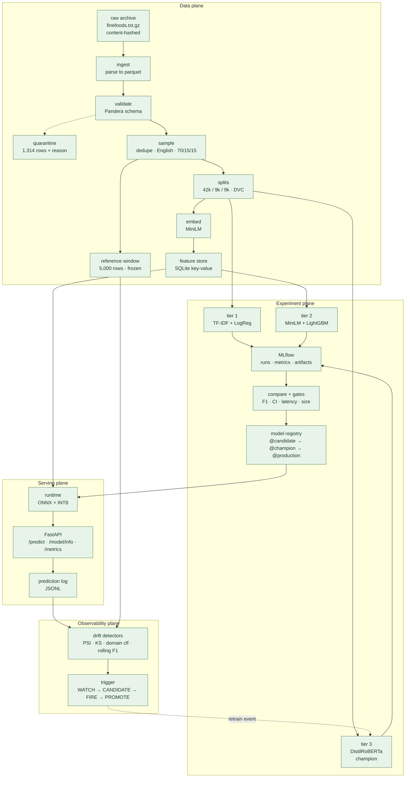

# moodrift

Predicts a 1–5 star rating from free-text product reviews, built as a full MLOps pipeline:
ingest → validate → version → train/compare → serve → monitor → retrain-trigger.

Data pipeline, three tracked model tiers, a versioned registry, FastAPI serving (ONNX +
INT8), and drift monitoring with a four-tier retraining trigger all run end to end — see
below for what shipped and what was measured.

## Current results

Held-out test split, 9,000 reviews. Macro-F1 is the headline metric, not accuracy: ~64% of
this corpus is 5-star, so predicting 5 unconditionally already scores 0.64. Latency is
measured on 200 real reviews at batch=1 on a single CPU thread.

| Tier | Model | Macro-F1 | Macro-MAE | Within 1 star | p95 | Size |
|---|---|---|---|---|---|---|
| 1 | TF-IDF + logistic regression | 0.5137 | 0.628 | 92.5% | 1.9 ms | 15 MB |
| 2 | MiniLM embeddings + LightGBM | 0.4292 | 1.000 | 88.4% | 25.7 ms | 10 MB |
| **3** | **Fine-tuned DistilRoBERTa** | **0.6001** | **0.4226** | **96.7%** | **43.7 ms** | **320 MB** |

**Tier 3 is the champion** — registered as `moodrift-classifier` v1 `@champion` — and the
confidence intervals do not overlap, so the margin is real rather than run-to-run noise.
It costs 24× the latency and 22× the size of the baseline for 8.6 macro-F1 points, and
still fits the < 130 ms serving budget with room to spare. Two more results worth reading
twice:

- **Plain TF-IDF beat the sentence-embedding tier by 8.5 points.** "Use a transformer" is
  not automatically right; the ladder is what showed which was which.
- **The fine-tune's gain sits in the minority classes**, which is what macro-F1 exists to
  measure: 2-star F1 goes 0.288 → 0.449 and 3-star 0.386 → 0.498, while 5-star barely
  moves. Accuracy would have hidden this — tiers 1 and 2 score within 0.2 points of each
  other on it.

Full breakdown in [`docs/model_comparison.md`](docs/model_comparison.md); raw run
history and registry state exported from MLflow:
[`docs/mlflow_exports/`](docs/mlflow_exports/summary.md).

## Quickstart

Requires Python 3.11 and [uv](https://docs.astral.sh/uv/). The raw corpus downloads
automatically (Stanford SNAP, no credentials needed).

```bash
make setup      # create .venv and install dependencies
make data       # run the full data pipeline via DVC (~15 min, downloads 122MB)
make train      # train and log tiers 1 and 2 to MLflow
make bench      # measure per-tier latency and artifact size
make compare    # regenerate the model comparison report
make register   # register the champion, behind the promotion gates
make mlflow-ui  # browse experiments at http://127.0.0.1:5000
```

Any logged run can be re-run and checked:

```bash
make reproduce RUN_ID=847d5707134c4119bc39018e354335c4
```

It verifies the commit, the data hashes and the config against what the run recorded,
retrains, and asserts the metric matches within a per-tier tolerance. **All three tiers
have been re-run and checked:**

| Tier | Original macro-F1 | Reproduced | Delta | Tolerance |
|---|---|---|---|---|
| 1 | 0.513706 | 0.513706 | 0.000000 | 0.0 (exact) |
| 2 | 0.429204 | 0.429204 | 0.000000 | 0.0 (exact) |
| 3 | 0.600110 | 0.600549 | 0.000439 | 0.005 |

The CPU tiers reproduce bit-for-bit. Tier 3 gets a documented band because Apple's MPS
backend is not bit-deterministic — three same-seed runs have now produced 0.6017, 0.6001
and 0.6005, a spread of 0.0016. Claiming byte-identical reproduction there would be false,
so the check asserts a band and the report says so.

`make help` lists every target.

`make data` needs no credentials and no DVC remote: it downloads the corpus from a public
URL and rebuilds every split. Verified from a clean clone — the regenerated splits are
byte-identical to the ones the published models were trained on.

Tier 3 needs a GPU and is run separately: `python -m src.train.tier3`. It auto-selects
CUDA, then Apple Silicon (MPS), then CPU — the published run took 52 minutes on an M1 Pro,
so a discrete GPU is not required.

## Architecture

Four planes, each runnable on its own. The serving plane never imports from the training
plane — the boundary between them is one model artifact plus one config file. Data flow,
the request-time sequence, and the registry promotion mechanics:
[`docs/architecture.md`](docs/architecture.md).



Design detail for the serving and observability planes: [API contract](docs/api_contract.md)
and [drift design](docs/drift_design.md); measured results: the sections below and
`docs/drift_report.md`. The dashed line from the trigger back to training is the
retraining loop: the trigger emits an event and does **not** train, so the decision stays
auditable on its own.

Text normalisation lives in one place (`src/features/clean.py`) and is shared by training and
serving, and features are cached in a SQLite feature store keyed by a hash of the normalised
text — together these are what keep train/serve skew structurally hard rather than merely
unlikely. The store earns its place measurably: a cache hit takes tier 2's p95 from 25.7 ms
to 1.3 ms.

Promotion uses MLflow **aliases**, not the deprecated stages (ADR-0004):
`@candidate` → `@champion` → `@production`. `make register` refuses to promote a model that
fails a gate in `conf/evaluation.yaml`, and writes the passing numbers into the version
description. **`@production` now points at champion v1** — it cleared the smoke and load
tests (`scripts/smoke_test.sh`, `docs/api_contract.md`'s HTTP load test) — and serving
always resolves that explicit alias, never "latest".

## Serving & monitoring

`docker compose up` runs the API, MLflow and Prometheus together; `GET /model/info` reports
exactly which registry version, git SHA and DVC data hash is live. The API resolves
`models:/moodrift-classifier@production`, exports to ONNX, and serves the INT8 build by
default — **313 MB → 79 MB (−75%) for an accuracy delta at noise level** (full table in
[`docs/api_contract.md`](docs/api_contract.md)). Six endpoints, every edge case in the
contract covered by `scripts/smoke_test.sh` and the Postman collection.

Two things measurement changed here, worth stating plainly rather than editing out:

- **Real batching for `/predict/batch` doesn't help the model actually served.** It shares
  one ONNX forward pass on the fp32 graph (verified bit-exact vs. looping), but the INT8
  graph — what `@production` runs — isn't batch-invariant under dynamic quantisation
  (measured: 5% of predicted stars flipped when batched vs. single-item), so it still
  loops there to stay correct. And even on fp32, a real batch call measured *no faster*
  than looping, single-threaded ONNX being compute- not overhead-bound. Full writeup in
  `docs/api_contract.md`.
- **Concurrent-load latency still exceeds the 130 ms target** (p95 226 ms at `hey -c 10`,
  vs. 122 ms sequential). Multi-worker `uvicorn` was tried and measured no better on this
  hardware. Left open rather than shipping an unverified fix.

Monitoring: PSI + KS input drift, a deliberately weak domain classifier for concept drift,
rolling macro-F1/MAE for performance drift, four ramped simulation scenarios, and a
four-tier `WATCH → CANDIDATE → FIRE → PROMOTE` trigger — design and thresholds justified in
[ADR-0006](docs/decisions/ADR-0006-drift-detection-approach.md) and
[ADR-0007](docs/decisions/ADR-0007-retraining-trigger-design.md), results in
[`docs/drift_report.md`](docs/drift_report.md).

## Data

[Amazon Fine Food Reviews](https://snap.stanford.edu/data/web-FineFoods.html) — 568,454
reviews. 567,140 pass validation; the rest are quarantined with a stated reason (never
dropped silently) in `data/interim/rejected/`. See
[`docs/data_quality_report.md`](docs/data_quality_report.md).

Training uses a 60,000-row proportional sample that preserves the real class imbalance;
imbalance is handled at training time with class weights rather than by reshaping the data.

## Design decisions

Non-obvious choices are recorded as ADRs in [`docs/decisions/`](docs/decisions/), including
why the sample is proportional rather than balanced, why the feature store is deliberately a
single SQLite file, and the cross-split text deduplication that removed ~13% test-set leakage.

## Known limitations

- English only. The filter runs in the sample stage rather than at ingestion, on an
  oversampled candidate pool - same end result, a fraction of the compute (ADR-0002).
- Trained on food-product reviews from 2012 and earlier; language and products have moved on.
- No sarcasm handling. It shows up clearly among the worst misclassifications: a 5-star
  review opening "made in china... so what?" is predicted 1-star at 93% confidence.
- Label noise is real: some 5-star reviews describe delivery problems rather than the product.
- Tier 2 needs PyTorch and LightGBM in one process, and their bundled OpenMP runtimes do not
  coexist on macOS/arm64: torch-first segfaults, LightGBM-first deadlocks, both silently.
  `OMP_NUM_THREADS=1` plus importing LightGBM first is the working combination, which
  `make bench` sets. The champion (tier 3) does not hit this.
- `/predict/batch` doesn't speed up the served (INT8) model over looping `/predict` N
  times — batching is numerically unsafe on that graph (measured) and doesn't help
  latency even where it is safe (fp32, also measured). See `docs/api_contract.md`.
- Concurrent request latency exceeds the 130 ms p95 target (measured 226 ms at 10
  concurrent requests); single sequential requests meet it comfortably (122 ms).

## Citations

- McAuley, J., & Leskovec, J. (2013). *From Amateurs to Connoisseurs: Modeling the
  Evolution of User Expertise through Online Reviews.* WWW '13 — source of the
  [Amazon Fine Food Reviews](https://snap.stanford.edu/data/web-FineFoods.html) dataset.
- Crowe, R., et al. *Machine Learning Production Systems.* O'Reilly, 2024.
- Burkov, A. *Machine Learning Engineering.* 2020.
- McMahon, A. P. *Machine Learning Engineering with Python* (2nd ed.). Packt, 2023.
