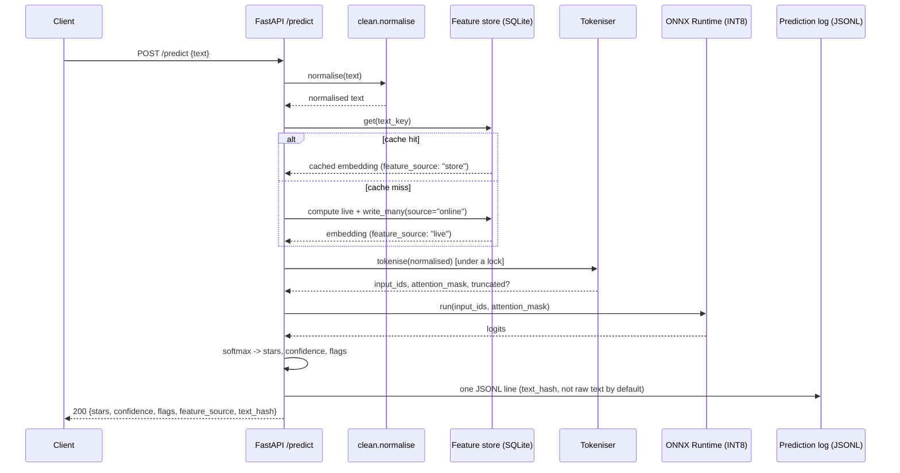

# Architecture — data flow and boundaries

The diagram lives in the [README](../README.md#architecture); this document is the data
flow and the rules that keep the four planes independently runnable instead of quietly
coupled. Read it alongside [`api_contract.md`](api_contract.md) (the serving contract) and
[`drift_design.md`](drift_design.md) (the monitoring design).

## Four planes, one artifact boundary between training and serving

```
Data plane:          download archive -> parse -> schema validation -> clean/normalise ->
                      dedupe -> language filter -> stratified sample -> embed + feature store
Experiment plane:     config (YAML) -> train tier 1/2/3 -> evaluate -> MLflow runs -> registry
Serving plane:        registry pull -> ONNX export + quantise -> FastAPI (feature-store
                      read-through) -> Docker image -> /predict
Observability plane:  prediction log -> drift detectors -> metrics + report -> trigger
                      policy -> retrain job
```

**The serving plane never imports from the training plane.** The only thing that crosses
the boundary is one model artifact plus its config — `src/serve/` has no import of
`src/train/`, `src/ingest/`, or the raw dataset. This is enforced by convention (no linter
rule for it), so treat it as a rule to check, not one to assume: if a serving change ever
needs a training-plane import, that is a design smell to stop and reconsider, not paper
over.

## Batch write path (data plane, Week 1)

For every validated, deduplicated, English-language row: compute the tier-2 sentence
embedding, hash the normalised text (`src.provenance.text_key`), and write
`(key, embedding, row_id, created_at, source='batch')` into
`data/feature_store/features.db`. This runs once, as its own DVC stage
(`dvc.yaml`'s `features` stage), and is what makes the feature store's row 1 timestamp
and `by_source.batch` count in `GET /model/info` meaningful — they say how much of the
store came from the batch write versus from live serving traffic.

## Online read path (serving plane, Week 3)



Two things worth being explicit about, because they are easy to assume wrong:

- **The champion's own forward pass does not consume the feature-store embedding.**
  Tier 3 (the fine-tuned transformer) tokenises and runs its own forward pass; the
  feature-store read-through above exists so the store keeps growing with real traffic
  and so monitoring has embeddings to compute drift features from, not to skip the
  champion's own inference. The store's read-through speed-up is real and measured, but
  it lands on tier 2 (25.7 ms -> 1.3 ms p95 on a cache hit) — see the
  [README](../README.md#current-results) for that number in context.
- **Normalisation runs through the same code on both paths.** `src/features/clean.py`'s
  `normalise()` is imported by both the batch sample stage and the online `/predict`
  route — not reimplemented twice. This is what keeps `text_key` consistent between a
  row written during training and the same text arriving at inference time; a second,
  subtly different normaliser on the serving side would silently break every cache hit
  and, worse, would mean the model sees text preprocessed differently from what it was
  trained on.

## Model registry — aliases, not stages

MLflow's Model Registry, versioned by its own auto-incrementing integer per registered
model name (`moodrift-classifier` v1, v2, v3...). Promotion moves **aliases**, not the
deprecated `Staging`/`Production` *stages* MLflow 3.x removed — see
[ADR-0004](decisions/ADR-0004-model-registry-aliases.md) for why.

| Alias | Set when |
|---|---|
| `@candidate` | The run clears the evaluation thresholds in `conf/evaluation.yaml` (macro-F1 target, beats the TF-IDF baseline). |
| `@champion` | Best model in the tier comparison (`docs/model_comparison.md`). |
| `@production` | Passes the API smoke test and load test (`scripts/smoke_test.sh`, the load table in `api_contract.md`) — or, for a later challenger, beats the current production model by >=1 F1 point with no per-slice regression (the trigger's `PROMOTE` tier, see `drift_design.md`). |

**Rollback is re-pointing `@production` at a previous version.** Nothing is deleted, so
every superseded version stays queryable. Serving always resolves an explicit alias —
`models:/moodrift-classifier@production`, never `"latest"` — so it is always auditable
which exact version is live; `GET /model/info` reports the resolved version, alias, MLflow
run ID, git SHA, and DVC data hash together, so a served prediction traces back to an
exact commit and an exact dataset through two independent identifiers at once.

## Retraining loop

The observability plane's trigger (`src/monitor/trigger.py`) **emits a decision; it does
not train.** `WATCH -> CANDIDATE -> FIRE -> PROMOTE` is a rule-based policy, not a model —
auditable by reading the thresholds in `conf/monitor.yaml`, not by trusting a black box.
`FIRE` starts a training run the same way any other run starts (`src/train/tier*.py`
logging to the same MLflow store); `PROMOTE` is the only tier that touches the registry.
Keeping the emit-vs-execute boundary explicit is what makes a firing something a human (or
CI) can review before anything retrains, rather than a silent automatic action. Design and
threshold justification: [`drift_design.md`](drift_design.md).

## Boundary rules

- The serving container never trains and never reads the raw dataset — it loads one
  artifact plus one config, produced ahead of time by `src/serve/export_onnx.py`.
- Every served artifact carries its git SHA, DVC data hash, and MLflow run ID.
  `GET /model/info` returns all three together.
- The feature store is a cache with one source of truth (the batch pipeline), not a
  second place features get computed differently — the online read-through fallback
  always calls the same transform code the batch write path uses.
- The retraining trigger emits an event; it does not itself retrain.
